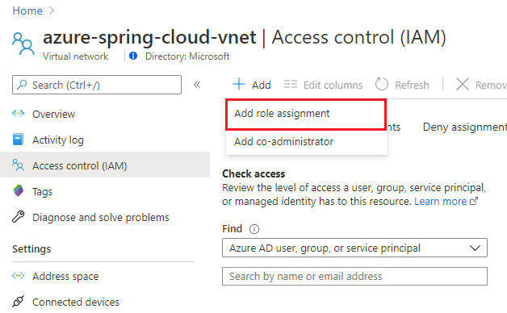
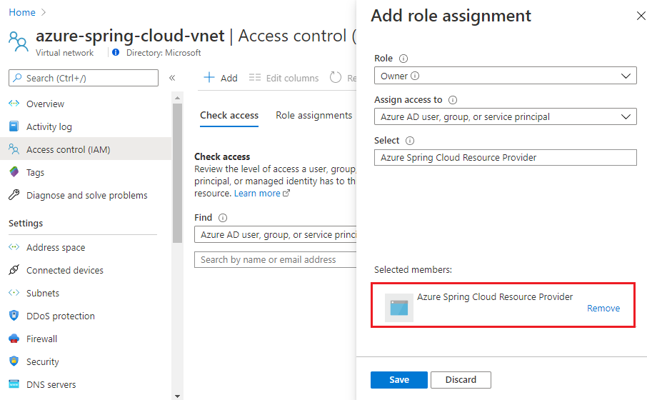
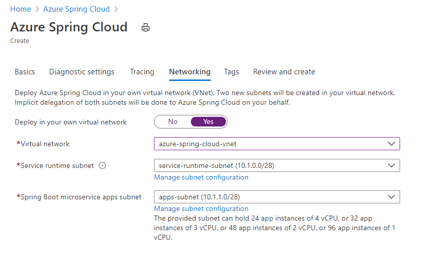
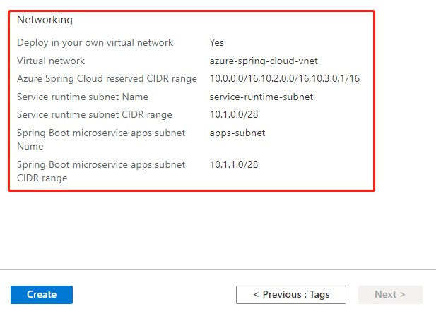

# Deploy Azure Spring Cloud in your Azure virtual network with smaller subnets

To solve IP address exhaustion under specific scenarios, Azure Spring Cloud can be deployed into Azure virtual networks with smaller subnets

## Prerequisites

Register Azure Spring Cloud resource provider *Microsoft.AppPlatform* followed by [Register Resource Provider on Azure Portal](https://docs.microsoft.com/en-us/azure/azure-resource-manager/management/resource-providers-and-types#azure-portal) or by running the following az cli command

```
az provider register --namespace Microsoft.AppPlatform
```

## Virtual network requirements

The virtual network that you deploy your Azure Spring Cloud service instance to must meet the following requirements:

- **Location**: The virtual network must reside in the same location as the Azure Spring Cloud service instance.

- **Subscription**: The virtual network must be in the same subscription as the Azure Spring Cloud service instance.

- **Subnets**: The virtual network must include two subnets dedicated to an Azure Spring Cloud service instance: one for Service Runtime and one for your Spring Boot Microservice Applications. There is a one-to-one relationship between these subnets and an Azure Spring Cloud service instance. You cannot share multiple service instances across a single subnet. You must use new subnets for each service instances you deploy.

- **Address space**: CIDR blocks up to **/28** for both Service Runtime subnet and Spring Boot Microservice Applications subnet.

- **Route table**: The subnets must not have existing route table associated.

## Create a virtual network

If you already have a virtual network to host Azure Spring Cloud service instance, please skip step 1, 2 and 3. You can start from step 4 to prepare subnets for the virtual network.

1. From the Azure portal menu, select **Create a resource**. From the Azure Marketplace, select **Networking > Virtual network**.

2. In **Create virtual network**, enter or select this information:

    | Setting        | Value                                            |
    | -------------- | ------------------------------------------------ |
    | Subscription   | Select your subscription.                        |
    | Resource group | Select your resource group, or create a new one. |
    | Name           | Enter *azure-spring-cloud-vnet*                  |
    | Location       | Select **East US**                               |

3. Select **Next: IP Addresses**, and for **IPv4 address space**, enter 10.1.0.0/16.

4. Select **Add subnet**, then enter *service-runtime-subnet* for Subnet name and *10.1.0.0/28* for **Subnet address range**, and select **Add**.

5. Select **Add subnet** again, then enter *apps-subnet* for Subnet name and *10.1.1.0/28* for **Subnet address range**, and select **Add**.

6. Select **Review + create**. Leave the rest as default and select **Create**.

## Grant Azure Spring Cloud service permission to the virtual network

Select the virtual network *azure-spring-cloud-vnet* you created.

1. Select **Access control (IAM)**, then select **Add > Add role assignment**.

    

2. In **Add role assignment**, enter or select this information:

    | Setting | Value                                        |
    | ------- | -------------------------------------------- |
    | Role    | Select **Owner**                             |
    | Select  | Enter *Azure Spring Cloud Resource Provider* |

    Then select *Azure Spring Cloud Resource Provider*, and select **Save**.

    

You can also achieve this by running the following az cli command

```
VIRTUAL_NETWORK_RESOURCE_ID=`az network vnet show \
    --name ${NAME_OF_VIRTUAL_NETWORK} \
    --resource-group ${RESOURCE_GROUP_OF_VIRTUAL_NETWORK} \
    --query "id" \
    --output tsv`

az role assignment create \
    --role "Owner" \
    --scope ${VIRTUAL_NETWORK_RESOURCE_ID} \
    --assignee e8de9221-a19c-4c81-b814-fd37c6caf9d2
```

## Deploy Azure Spring Cloud service instance in the virtual network

1. Open the Azure portal using link https://ms.portal.azure.com.

2. From the top search box, search for **Azure Spring Cloud**, and select **Azure Spring Cloud** from the result.

3. On the **Azure Spring Cloud** page, select **+ Add**.

4. Fill out the form on the Azure Spring Cloud **Create** page. Please select the same region as the virtual network.

5. Select **Networking** tab and select this information:

    | Setting                              | Value                            |
    | ------------------------------------ | -------------------------------- |
    | Deploy in your own virtual network   | Select **Yes**                   |
    | Virtual network                      | Select *azure-spring-cloud-vnet* |
    | Service runtime subnet               | Select *service-runtime-subnet*  |
    | Spring Boot microservice apps subnet | Select *apps-subnet*             |

    

6. Select **Review and create**.

7. Verify your specifications, and click **Create**.

    

## Limitation

Small subnet range saves IP addresses, but brings limitations to the maximum number of App Instances the Azure Spring Cloud can hold. 

| CIDR | Total IPs | Available IPs | Maximum app instances                                        |
| ---- | --------- | ------------- | ------------------------------------------------------------ |
| /28  | 16        | 8             | <p> App with 1 core:96 <br/> App with 2 cores: 48<br/>  App with 3 cores: 32 <br/> App with 4 cores: 24 </p> |
| /27  | 32        | 24            | <p> App with 1 core: 228<br/> App with 2 cores: 144<br/>  App with 3 cores: 96 <br/>  App with 4 cores: 72</p> |
| /26  | 64        | 56            | <p> App with 1 core: 500<br/> App with 2 cores: 336<br/>  App with 3 cores: 224<br/>  App with 4 cores: 168</p> |
| /25  | 128       | 120           | <p> App with 1 core: 500<br> App with 2 cores:  500<br>  App with 3 cores:  480<br>  App with 4 cores: 360</p> |
| /24  | 256       | 248           | <p> App with 1 core: 500<br/> App with 2 cores:  500<br/>  App with 3 cores: 500<br/>  App with 4 cores: 500</p> |

## See also

- [02 - Deploy Application to Azure Spring Cloud in your VNet](02-deploy-application-to-azure-spring-cloud-in-your-vnet.md)
- [05 - Troubleshooting Azure Spring Cloud in VNET](05-troubleshooting-azure-spring-cloud-in-vnet.md)
- [06 - Customer Responsibilities for Running Azure Spring Cloud in VNET](